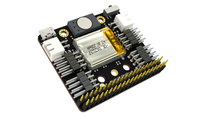

# mpython shield 掌控宝




---------------------------------------------------------


## 链接
- **本用户库加载地址:** ```https://github.com/liliang9693/ext-parrotshield```
- **Mind+下载地址：** [http://mindplus.cc](http://mindplus.cc "http://mindplus.cc")    
- **Mind+扩展库教程：** [https://mindplus.dfrobot.com.cn/extensions-user](https://mindplus.dfrobot.com.cn/extensions-user "https://mindplus.dfrobot.com.cn/extensions-user")    

## 简介

- **介绍：** 本扩展库实现在图形模块上控制掌控宝扩展板。  

## Blocks


## 示例


## License

MIT

## 硬件支持

MCU                | JavaScript    | Arduino   | MicroPython    | Remarks
------------------ | :----------: | :----------: | :---------: | -----
micro:bit        |             |              |             | 
mpython        |             |        √      |      √       | 
arduino uno    |             |              |             | 
 

## 更新日志
- V0.1.0  20200223 第一版发布
- V0.2.0  20200419 根据Mind+1.6.3开放的microPython用户库增加支持


